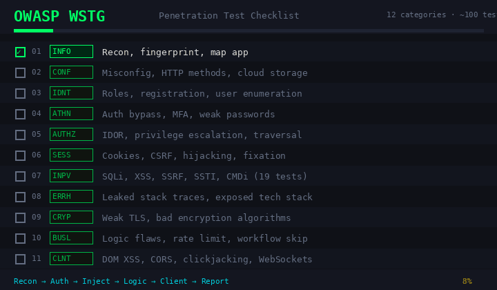

# OWASP WSTG Pentest Checklist

<div align="center">
  
  <p align="center">
    <b>Figure: Demo </b>
  </p>
</div>

> 12 categories. ~100 test cases. Full web app pentest coverage.

---

## What's Inside

| # | Category | What It Tests |
|---|---|---|
| 1 | **INFO** — Information Gathering | Recon, fingerprint, map app |
| 2 | **CONF** — Configuration | Misconfig, HTTP methods, cloud storage |
| 3 | **IDNT** — Identity Management | Roles, registration, user enumeration |
| 4 | **ATHN** — Authentication | Auth bypass, MFA, weak passwords |
| 5 | **AUTHZ** — Authorization | IDOR, privilege escalation, traversal |
| 6 | **SESS** — Session Management | Cookies, CSRF, hijacking, fixation |
| 7 | **INPV** — Input Validation | SQLi, XSS, SSRF, SSTI, CMDi (19 tests) |
| 8 | **ERRH** — Error Handling | Leaked stack traces, exposed tech stack |
| 9 | **CRYP** — Cryptography | Weak TLS, bad encryption algorithms |
| 10 | **BUSL** — Business Logic | Logic flaws, rate limit bypass, workflow skip |
| 11 | **CLNT** — Client-Side | DOM XSS, CORS, clickjacking, WebSockets |
| 12 | **APIT** — API Testing | GraphQL, REST auth, mass assignment |

---

## Attack Flow

```
Recon (INFO + CONF)
  → Auth Attack (ATHN + AUTHZ + SESS)
    → Injection Fuzzing (INPV)
      → Logic Abuse (BUSL)
        → Client & API (CLNT + APIT)
          → Report: WSTG ID + CVSS score per finding
```

---

## References

- [OWASP WSTG](https://owasp.org/www-project-web-security-testing-guide/)
- [OWASP Top 10](https://owasp.org/www-project-top-ten/)
- [OWASP ZAP](https://www.zaproxy.org/)
